# HomeLab

HomeLab Server/Cluster, Virtual Sandbox Cluster, & Desktop Configuration

## Table of Contents

- [HomeLab](#homelab)
  - [Table of Contents](#table-of-contents)
  - [Remote VsCode](#remote-vscode)
  - [Server](#server)
    - [Networking](#networking)
    - [Kubernetes](#kubernetes)
      - [OKD WIF](#okd-wif)
      - [Kubernetes Commands](#kubernetes-commands)
        - [Delete Pod Using Graceful Termination Eviction Request](#delete-pod-using-graceful-termination-eviction-request)
      - [SSH Keyscan](#ssh-keyscan)
      - [Vault Kubernetes Integration](#vault-kubernetes-integration)

## Remote VsCode

```bash
 ansible-playbook -i ansible/inventory --ask-become-pass ansible/vscode-server.yaml --ask-pass \
  -e 'ansible_python_interpreter=/usr/bin/python3'
```

## Server

```mermaid
graph TD
 linkStyle default interpolate basis

subgraph Networking
wan1[<center>WAN<br>192.168.100.1</center>]---|1000/50 Mb|router{<center>UDM Pro SE<br>10.0.0.1</center>}
wan2[<center>LTE<br>192.168.1.1</center>]---|750/25 Mb|router
router---|10GbE|switch1[<center>USW-Pro-Max-16<br></center>]
router---|2.5GbE|ap1{<center>U7 Pro Wall<br></center>}
switch1---|2.5GbE|ap2{<center>U7 Pro Max<br></center>}
switch1----|10GbE|switch10[<center>USW-Aggregation<br></center>]
switch10----|10GbE|switch11[<center>USW-Aggregation<br></center>]
router----|10GbE|switch11[<center>USW-Aggregation<br></center>]



end

subgraph Homelab
router----|1GbE|microshift[<center>MicroShift / PiHole<br>10.0.0.99</center>]
router-.-|1GbE Fail Over|truenas(<center>TrueNas<br>10.101.1.6</center>)
end

subgraph OpenShift/OKD
    switch1---|2.5GbE|truenas(<center>TrueNas<br>10.101.1.6</center>)
    switch1-.-|1GbE Fail Over Host/Pod/LB|server-1(<center>server-1<br>10.101.10.101</center>)
    switch1-.-|1GbE Fail Over Host/Pod/LB|server-2(<center>server-2<br>10.101.10.102</center>)
    switch1-.-|1GbE Fail Over Host/Pod/LB|server-3(<center>server-3<br>10.101.10.103</center>)

    switch1-.-|1GbE Fail Over NAD/LM|server-1(<center>server-1<br>10.101.10.101</center>)
    switch1-.-|1GbE Fail Over NAD/LM|server-2(<center>server-2<br>10.101.10.102</center>)
    switch1-.-|1GbE Fail Over NAD/LM|server-3(<center>server-3<br>10.101.10.103</center>)

    switch1-.-|1GbE Fail Over Ceph Public|server-1(<center>server-1<br>10.101.10.101</center>)
    switch1-.-|1GbE Fail Over Ceph Public|server-2(<center>server-2<br>10.101.10.102</center>)
    switch1-.-|1GbE Fail Over Ceph Public|server-3(<center>server-3<br>10.101.10.103</center>)

    switch1-.-|1GbE Fail Over Ceph Private|server-1(<center>server-1<br>10.101.10.101</center>)
    switch1-.-|1GbE Fail Over Ceph Private|server-2(<center>server-2<br>10.101.10.102</center>)
    switch1-.-|1GbE Fail Over Ceph Private|server-3(<center>server-3<br>10.101.10.103</center>)

    switch10----|10 GbE Host/Pod/LB|server-1(<center>server-1<br>10.101.10.101</center>)
    switch10----|10 GbE Host/Pod/LB|server-2(<center>server-2<br>10.101.10.102</center>)
    switch10----|10 GbE Host/Pod/LB|server-3(<center>server-3<br>10.101.10.103</center>)

    switch10----|10 GbE NAD/LM|server-1(<center>server-1<br>10.101.10.101</center>)
    switch10----|10 GbE NAD/LM|server-2(<center>server-2<br>10.101.10.102</center>)
    switch10----|10 GbE NAD/LM|server-3(<center>server-3<br>10.101.10.103</center>)

    switch11----|10 GbE Ceph Public|server-1(<center>server-1<br>10.101.10.101</center>)
    switch11----|10 GbE Ceph Public|server-2(<center>server-2<br>10.101.10.102</center>)
    switch11----|10 GbE Ceph Public|server-3(<center>server-3<br>10.101.10.103</center>)

    switch11----|10 GbE Ceph Private|server-1(<center>server-1<br>10.101.10.101</center>)
    switch11----|10 GbE Ceph Private|server-2(<center>server-2<br>10.101.10.102</center>)
    switch11----|10 GbE Ceph Private|server-3(<center>server-3<br>10.101.10.103</center>)
end
```



### Networking

**Networking Machines:**

| NAME             | Type   | Status |
| ---------------- | ------ | ------ |
| SB6183           | Modem  |        |
| UDM SE           | Router |        |
| USW Pro Max 16   | Switch |        |
| USW Aggregation  | Switch |        |
| USW Aggregation  | Switch |        |
| USWFlex XG 10GbE | Switch | Died   |
| U7 Pro Max       | AP     |        |
| U7 Pro Wall      | AP     |        |

**Vlans:**

| Site    | Range      |
| ------- | ---------- |
| TODO: 1 | 10.101.X.X |
| 2       | 10.102.X.X |

| Name    | VLAN ID | Subnet        | Info                   |
| ------- | ------- | ------------- | ---------------------- |
| infra   | 1       | 10.102.1.0/24 |                        |
| clients | 2       | 10.102.2.0/24 |                        |
| iot     | 3       | 10.102.3.0/24 | TODO: Enable Isolation |

| Name                      | VLAN ID | Subnet         | Info                    |
| ------------------------- | ------- | -------------- | ----------------------- |
| infrastructure            | 111     | 10.101.1.0/24  |                         |
| clients                   | X       | 10.101.2.0/24  | TODO: Create            |
| iot                       | X       | 10.101.3.0/24  | TODO: Create            |
| openshift-legacy          | 4       | 10.0.0.0/24    | To be Decommissioned    |
| openshift-machine-network | 10      | 10.101.10.0/24 | Host/Pod/Load Balancers |
| openshift-nad             | 11      | 10.101.11.0/24 | Virtual Machines        |
| openshift-ceph-private    | 12      | 10.101.12.0/24 | TODO: Enable Isolation  |
| openshift-ceph-public     | 13      | 10.101.13.0/24 | TODO: Enable Isolation  |
| openshift-lm              | 14      | 10.101.14.0/24 | TODO: Enable Isolation  |
| openshift-ovn-network     | 15      | 10.101.15.0/24 | Isolated                |
| openshift-service-network | 16      | 10.101.16.0/22 | Isolated                |
| openshift-pod-network     | 32      | 10.101.32.0/19 | Isolated                |

### Kubernetes

<https://www.okd.io/>

| Kubernetes Channel | OKD Version | OKD Channel   | OKD OS                   | Storage Layer |
| ------------------ | ----------- | ------------- | ------------------------ | ------------- |
| v1.33.\*           | 4.19-\*     | stable-scos-4 | CentOS Stream CoreOS 9.0 | CEPH          |

**Machines:**

[CPU Benchmark](https://www.cpubenchmark.net/compare/Intel-i5-6600-vs-AMD-RX-427BB-vs-Intel-i3-2130-vs-AMD-GX-415GA-SOC-vs-AMD-Ryzen-7-5700G/2594vs2496vs755vs2081vs4323)

| Machine    | Model          | CPU      | CPU | Mem  | Storage                           | Networking              | ZFS Storage  | Status         |
| ---------- | -------------- | -------- | --- | ---- | --------------------------------- | ----------------------- | ------------ | -------------- |
| MicroShift | Raspberry Pi 5 | BCM2712  | 4   | 8G   | 1TB NVME                          | 1x1GbE                  | N/A          | MicroShift     |
| server-1   | N/A            | R7-5700G | 16  | 128G | 2x4TB NVME, 2x1TB SSD, 2x.5TB SSD | 4x10Gbe (DAC) && 4x1GbE | N/A          | OpenShift/OKD  |
| server-2   | N/A            | R7-5700G | 16  | 128G | 2x4TB NVME, 2x1TB SSD,2x.5TB SSD  | 4x10Gbe (DAC) && 4x1GbE | N/A          | OpenShift/OKD  |
| server-3   | N/A            | R7-5700G | 16  | 128G | 2x4TB NVME, 2x1TB SSD,2x.5TB SSD  | 4x10Gbe (DAC) && 4x1GbE | N/A          | OpenShift/OKD  |
| TrueNas    | Hp ProDesk     | i5-6600  | 4   | 32G  | 120G SSD Boot Mirror              | 1x2.5Gbe && 1x1GbE      | 5x2TB RaidZ2 | TrueNas        |
| pfSense    | Hp t730        | RX-427BB | 4   | 4G   | 16G SSD                           | 4x1GbE                  | N/A          | Decommissioned |
| Bare Metal | Hp t620        | GX-415GA | 4   | 6G   | 16G SSD & 16G USB                 | 1x1GbE                  | N/A          | Decommissioned |
| Spare      | Hp p7-1226s    | i3-2130  | 4   | 8G   | 240G SSD                          |                         | N/A          | Decommissioned |

| Machine  | PPT | CPU Curve | GFX Curve | CPU Frequency | vMem | Memory Freq |
| -------- | --- | --------- | --------- | ------------- | ---- | ----------- |
| server-1 | 40W | -20       | -30       | -750          | 1.35 | 3200        |
| server-2 | 40W | -20       | -30       | -750          | 1.35 | 3200        |
| server-3 | 40W | -20       | -30       | -750          | 1.35 | 3200        |

**ZFS Storage:**

| Machine | Use    | Dataset   | Size  | Dataset     | Size  | Dataset       | Size  | Disks (SSD)  |
| ------- | ------ | --------- | ----- | ----------- | ----- | ------------- | ----- | ------------ |
| TrueNas | Backup | Nextcloud | 750GB | Ceph Backup | 175GB | WindowsBackup | 750GB | 5x2TB RaidZ2 |

**Kubernetes Nodes:**

| Attribute             | Value                 |
| --------------------- | --------------------- |
| **NAME**              | server-1/2/3          |
| **ROLES**             | control-plane, worker |
| **CPU**               | 16                    |
| **Mem**               | 128G                  |
| **OS Disk**           | mdadm 2x5TB SSD       |
| **Container Overlay** | mdadm 2x1TB SSD       |
| **Ceph Storage**      | 2x4TB CEPH NVME       |
| **Nic's**             | 4x10GbE/1GbE A/P      |
| **Bond 0:** v10       | Host/Pod/LoadBalancer |
| **Bond 2:** v12       | Ceph Private          |
| **Bond 3:** v13       | Ceph Public           |
| **Bond 4:** v14       | VM Live Migrate       |
| **Bond 4.3**          | IOT                   |
| **Bond 4.11**         | Virtual Machines      |
| **Bond 4.111**        | Infrastructure        |

#### OKD WIF

- <https://github.com/openshift/cloud-credential-operator/blob/master/docs/gcp_workload_identity.md>
- <https://github.com/openshift/cloud-credential-operator/blob/master/docs/ccoctl.md>

File Configuration Locations

```bash
ls ./terraform/gcp/HomeLab/homelab
ls ./terraform/gcp/HomeLab/homelab/wif
ls ./okd/okd-configuration/wif.yaml
```

CCOCTL Binary: <https://mirror.openshift.com/pub/openshift-v4/amd64/clients/ocp/stable/ccoctl-linux.tar.gz>

```bash
PROJECT_ID="$(vault kv get -field=project_id secret/gcp/org/av/projects)"

./ccoctl gcp create-workload-identity-pool --name=okd-homelab-wif --project=homelab-${PROJECT_ID} --dry-run
./ccoctl gcp create-workload-identity-provider --name=okd-homelab-wif --region=us --project=homelab-${PROJECT_ID} \
  --public-key-file=serviceaccount-signer.public --workload-identity-pool=okd-homelab-wif --dry-run
```

#### Kubernetes Commands

```bash
oc login --web --server https://api.okd.homelab.arthurvardevanyan.com:6443

# Kubernetes Dashboard
# https://upcloud.com/community/tutorials/deploy-kubernetes-dashboard
kubectl get secret -n kubernetes-dashboard admin-user-token -o jsonpath="{.data.token}" | base64 --decode

# Watch ALl Pods
watch kubectl get pods -A -o wide --sort-by=.metadata.creationTimestamp
# Delete Pods that Have a Restart
kubectl get pods -A | awk '$5>0' | awk '{print "kubectl delete pod -n " $1 " " $2}' | bash -
# Drain Node
kubectl drain k3s-server --ignore-daemonsets --delete-emptydir-data
# Vault
kubectl exec -it vault-0 -n vault -- vault operator unseal --tls-skip-verify
# Nextcloud
kubectl exec -it nextcloud-0 -n nextcloud -- runuser -u www-data -- php -f /var/www/html/occ

kubectl label node ${NODE} topology.kubernetes.io/zone=${ZONE} --overwrite
```

##### Delete Pod Using Graceful Termination Eviction Request

```bash
NAMESPACE=homelab
POD=el-webhook-6b56cc5f84-clfc6

curl --header "Authorization: Bearer $(oc whoami -t)" -H 'Content-type: application/json' \
"$(oc whoami --show-server)/api/v1/namespaces/{$NAMESPACE}/pods/{$POD}/eviction" \
-d '{"apiVersion": "policy/v1","kind": "Eviction","metadata": {"name": "'"${POD}"'","namespace": "'"${NAMESPACE}"'"}}'
```

- <https://docs.okd.io/latest/rest_api/policy_apis/eviction-policy-v1.html#eviction-policy-v1>
- <https://unofficial-kubernetes.readthedocs.io/en/latest/tasks/configure-pod-container/configure-pod-disruption-budget/>

#### SSH Keyscan

```bash
export IP_LIST="3 4 5 17 107 108 109 101 102 103 111 112 113 114 115 116 121 122 123"

rm -f /tmp/ssh_keyscan.txt
for IP in $( echo "$IP_LIST" ); do
ssh-keyscan 10.0.0."${IP}" >> /tmp/ssh_keyscan.txt
done

echo "\n\n\nSSH Keyscan\n\n"
cat /tmp/ssh_keyscan.txt
```

#### Vault Kubernetes Integration

```bash
# https://blog.ramon-gordillo.dev/2021/03/gitops-with-argocd-and-hashicorp-vault-on-kubernetes/
# https://cloud.redhat.com/blog/how-to-use-hashicorp-vault-and-argo-cd-for-gitops-on-openshift
# https://itnext.io/argocd-secret-management-with-argocd-vault-plugin-539f104aff05
vault auth enable kubernetes

token_reviewer_jwt=$(kubectl get secrets -n argocd -o jsonpath="{.items[?(@.metadata.annotations.kubernetes.io/service-account.name=='argocd-repo-server')].data.token}" |base64 -d)

#kubernetes_host=$(oc whoami --show-server)
kubernetes_host="https://kubernetes.default.svc:443"

# Pod With Service Account Token Mounted
kubectl cp -n homelab toolbox-0:/var/run/secrets/kubernetes.io/serviceaccount/..data/ca.crt /tmp/ca.crt

vault write auth/kubernetes/config \
   token_reviewer_jwt="${token_reviewer_jwt}" \
   kubernetes_host=${kubernetes_host} \
   kubernetes_ca_cert=@/tmp/ca.crt \
   disable_local_ca_jwt=true

vault write auth/kubernetes/role/argocd \
    bound_service_account_names=argocd-repo-server \
    bound_service_account_namespaces=argocd \
    policies=argocd \
    ttl=1h

vault policy write argocd - <<EOF
path "secret/*" {
    capabilities = ["create", "read", "update", "delete", "list"]
}
EOF

vault write auth/kubernetes/login role=argocd jwt=$(cat /var/run/secrets/kubernetes.io/serviceaccount/token)
```

Additional Policy for Terraform

```hcl
path "auth/token/create" {
  capabilities = ["create", "read", "update", "list"]
}
```

```bash
export VAULT_TOKEN=$(vault login --tls-skip-verify -address=https://vault.arthurvardevanyan.com -method=userpass -token-only username=arthur)
```
