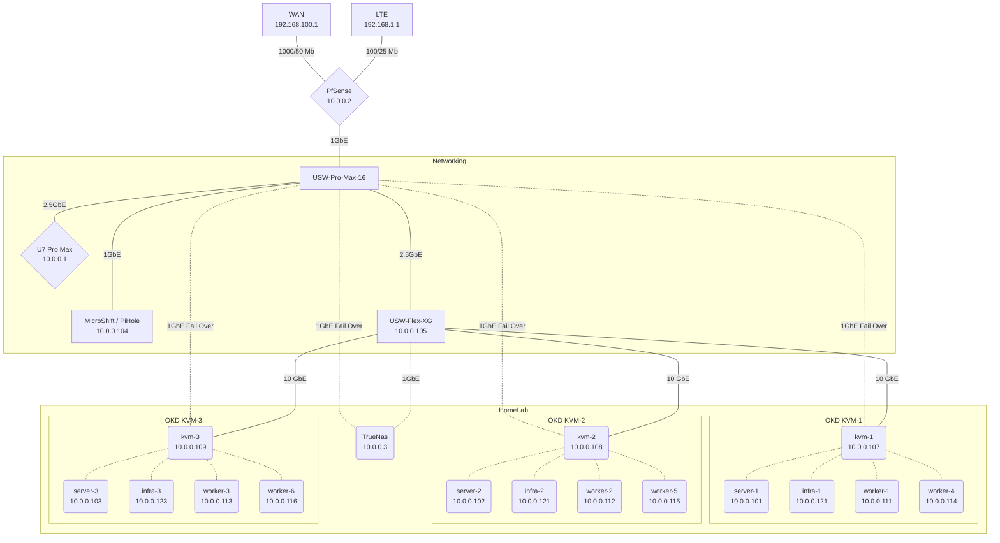

# HomeLab

HomeLab Server/Cluster, Virtual Sandbox Cluster, & Desktop Configuration

- Desktop: Fedora 39

## Table of Contents

- [HomeLab](#homelab)
  - [Table of Contents](#table-of-contents)
  - [Desktop](#desktop)
    - [Gnome](#gnome)
    - [Cura](#cura)
  - [Virtual Sandbox](#virtual-sandbox)
  - [KVM Sandbox Terraform](#kvm-sandbox-terraform)
  - [Server](#server)
    - [Kubernetes](#kubernetes)
      - [KVM Config Dump](#kvm-config-dump)
      - [OKD Longhorn Secondary Disk Setup](#okd-longhorn-secondary-disk-setup)
      - [OKD Upgrade](#okd-upgrade)
      - [OKD Host Disk Expansion](#okd-host-disk-expansion)
      - [OKD Host Bad Block Recovery](#okd-host-bad-block-recovery)
      - [OKD WIF](#okd-wif)
      - [Kubernetes Commands](#kubernetes-commands)
        - [Delete Pod Using Graceful Termination Eviction Request](#delete-pod-using-graceful-termination-eviction-request)
      - [SSH Keyscan](#ssh-keyscan)
      - [Vault Kubernetes Integration](#vault-kubernetes-integration)
      - [k3s Install](#k3s-install)
  - [Database](#database)
    - [MariaDB](#mariadb)
    - [Postgres](#postgres)
  - [Quay](#quay)
  - [Tekton](#tekton)

## Desktop

```bash
ansible-playbook -i ansible/inventory --ask-become-pass ansible/desktop.yaml --ask-pass \
  -e 'ansible_python_interpreter=/usr/bin/python3'

git merge --no-ff
scp -r /mnt/storage/vm/*.img windowsBackup@10.0.0.4:/backup/WindowsBackup/vm
sudo sensors-detect
```

### Gnome

Manually Install Extensions from extensions.gnome.org

- gnome-shell-extension-netspeed
- gnome-shell-extension-places-menu
- gnome-shell-extension-transparentnotification

### Cura

Config files need to be applied manually.

```bash
machineConfigs/desktop/home/arthur/cura
```

## Virtual Sandbox

```bash
# Terminal 1
# Generate Preseed Config Password and Startup Temporary Web Server
bash kvm_k3s.bash preseed_server

# Terminal 2
# Enter Password Defined with Hash in Pre Seed Config
mkdir -p notes time bash kvm_k3s.bash install_cluster > notes/install.log

# KubeConfig
export KUBECONFIG=${HOME}/vm/sk3s/sk3s.yaml

# Dashboard Secret
bash main.bash get_dashboard_secret
```

## KVM Sandbox Terraform

TF Provider

- <https://github.com/dmacvicar/terraform-provider-libvirt>
- <https://registry.terraform.io/providers/dmacvicar/libvirt/latest/docs>

OpenShift Terraform Example

- <https://github.com/openshift/installer/blob/master/docs/dev/libvirt/README.md>
- <https://github.com/openshift/installer/tree/master/data/data/libvirt/bootstrap>

Permission Denied Issue

- <https://github.com/jedi4ever/veewee/issues/996#issuecomment-497976612>

## Server



### Kubernetes

<https://www.okd.io/>

| Kubernetes Channel | OKD Version | OKD Channel   | OKD OS    | Host Operating System | Storage Layer |
| ------------------ | ----------- | ------------- | --------- | --------------------- | ------------- |
| v1.29              | 4.16-\*     | stable-scos-4 | SCOS 4.17 | RHEL 9.4              | CEPH          |

**Machines:**

[CPU Benchmark](https://www.cpubenchmark.net/compare/Intel-i5-6600-vs-AMD-RX-427BB-vs-Intel-i3-2130-vs-AMD-GX-415GA-SOC-vs-AMD-Ryzen-7-5700G/2594vs2496vs755vs2081vs4323)

| Machine    | Model       | CPU      | CPU | Mem  | Storage                        | ZFS Storage    |
| ---------- | ----------- | -------- | --- | ---- | ------------------------------ | -------------- |
| pfSense    | Hp t730     | RX-427BB | 4   | 4G   | 16G SSD                        | N/A            |
| Bare Metal | Hp t620     | GX-415GA | 4   | 6G   | 16G SSD & 16G USB              | N/A            |
| kvm-1      | N/A         | R7-5700G | 16  | 128G | 1x4TB NVME, 1x1TB NVME, SSD    | N/A            |
| kvm-2      | N/A         | R7-5700G | 16  | 128G | 1x4TB NVME, 1x1TB NVME,1TB SSD | N/A            |
| kvm-3      | N/A         | R7-5700G | 16  | 128G | 1x4TB NVME, 1x1TB NVME,1TB SSD | N/A            |
| TrueNas    | Hp ProDesk  | i5-6600  | 4   | 32G  | 120G SSD Boot Mirror           | 2T SSD, 1T SSD |
| Spare      | Hp p7-1226s | i3-2130  | 4   | 8G   | 240G SSD                       | N/A            |

| Machine | PPT | CPU Curve | GFX Curve | CPU Frequency | vMem | Memory Freq |
| ------- | --- | --------- | --------- | ------------- | ---- | ----------- |
| kvm-1   | 40W | -25       | -30       | -500          | 1.35 | 3200        |
| kvm-2   | 40W | -25       | -30       | -500          | 1.35 | 3200        |
| kvm-3   | 40W | -25       | -30       | -500          | 1.35 | 3200        |

**ZFS Storage:**

| Machine | Use     | Dataset   | Size  | Dataset     | Size  | Dataset       | Size  |
| ------- | ------- | --------- | ----- | ----------- | ----- | ------------- | ----- |
| TrueNas | Primary | Nextcloud | 750GB | Ceph Backup | 175GB | N/A           | N/A   |
| TrueNas | Backup  | Nextcloud | 750GB | Ceph Backup | 175GB | WindowsBackup | 750GB |

**Kubernetes Nodes:**

| NAME     | ROLES          | Machine | vCPU | Mem   | Storage         |
| -------- | -------------- | ------- | ---- | ----- | --------------- |
| server-1 | cp,etcd,master | kvm-1   | 8    | 31.0G | N/A             |
| server-2 | cp,etcd,master | kvm-2   | 8    | 31.0G | N/A             |
| server-3 | cp,etcd,master | kvm-1   | 8    | 31.0G | N/A             |
| infra-1  | infra,worker   | kvm-1   | 6    | 33.0G | 1x4TB CEPH NVME |
| infra-2  | infra,worker   | kvm-2   | 6    | 33.0G | 1x4TB CEPH NVME |
| infra-3  | infra,worker   | kvm-3   | 6    | 33.0G | 1x4TB CEPH NVME |
| worker-1 | worker         | kvm-1   | 12   | 57.0G | N/A             |
| worker-2 | worker         | kvm-2   | 12   | 57.0G | N/A             |
| worker-3 | worker         | kvm-3   | 12   | 57.0G | N/A             |

#### KVM Config Dump

```bash
scp ./* arthur@10.0.0.17:/home/arthur/Downloads

sudo virsh dumpxml infra-1 > infra-1.xml
sudo virsh dumpxml server-1 > server-1.xml
sudo virsh dumpxml worker-1 > worker-1.xml
sudo virsh dumpxml worker-4 > worker-4.xml

sudo virsh dumpxml infra-2 > infra-2.xml
sudo virsh dumpxml server-2 > server-2.xml
sudo virsh dumpxml worker-2 > worker-2.xml
sudo virsh dumpxml worker-5 > worker-5.xml

sudo virsh dumpxml infra-3 > infra-3.xml
sudo virsh dumpxml server-3 > server-3.xml
sudo virsh dumpxml worker-3 > worker-3.xml
sudo virsh dumpxml worker-6 > worker-6.xml
```

#### OKD Longhorn Secondary Disk Setup

```bash
# https://askubuntu.com/questions/144894/add-physical-disk-to-kvm-virtual-machine
sudo mkfs.ext4 -L longhorn /dev/nvme0n1
sudo mkfs.ext4 -L longhorn1 /dev/nvme1n1

# Sandbox
sudo mkfs.ext4 -L longhorn /dev/vdb
sudo mkfs.ext4 -L longhorn1 /dev/vdc

# Pre Machine Config (Sandbox)
sudo su
echo "/dev/vdb /var/mnt/longhorn auto nofail" > /etc/fstab
sudo reboot

export NODE=""
oc annotate node ${NODE} --overwrite node.longhorn.io/default-disks-config='[{"path":"/var/mnt/longhorn","allowScheduling":true}]'
oc label node ${NODE} node.longhorn.io/create-default-disk=config

# Infra
kubectl taint node ${NODE} node-role.kubernetes.io/infra:NoSchedule
kubectl label node ${NODE} node-role.kubernetes.io/infra=""

```

#### OKD Upgrade

```bash
bash main.bash stateful_workload_stop
kubectl delete pdb -n longhorn-system --all
bash main.bash stateful_workload_start
```

#### OKD Host Disk Expansion

```bash
# KVM
sudo qemu-img resize X.raw +XG

# Node
# https://access.redhat.com/discussions/6230831#comment-2163981
sudo su
growpart /dev/vda 4
lsblk
sudo su -
unshare --mount
mount -o remount,rw /sysroot
xfs_growfs /sysroot
df -h | grep vda
```

#### OKD Host Bad Block Recovery

```bash
dd if=/mnt/source/source.raw  of=/mnt/destination/destination.raw bs=4k conv=noerror,sync
```

#### OKD WIF

- <https://github.com/openshift/cloud-credential-operator/blob/master/docs/gcp_workload_identity.md>
- <https://github.com/openshift/cloud-credential-operator/blob/master/docs/ccoctl.md>

File Configuration Locations

```bash
ls ./terraform/gcp/HomeLab/homelab
ls ./terraform/gcp/HomeLab/homelab/wif
ls ./okd/okd-configuration/wif.yaml
```

CCOCTL Binary: <https://mirror.openshift.com/pub/openshift-v4/amd64/clients/ocp/stable/ccoctl-linux.tar.gz>

```bash
PROJECT_ID="$(vault kv get -field=project_id secret/gcp/org/av/projects)"

ccoctl gcp create-workload-identity-pool --name=okd-homelab-wif --project=homelab-${PROJECT_ID} --dry-run
ccoctl gcp create-workload-identity-provider --name=okd-homelab-wif --region=us --project=homelab-${PROJECT_ID} \
  --public-key-file=serviceaccount-signer.public --workload-identity-pool=okd-homelab-wif --dry-run
```

#### Kubernetes Commands

```bash
oc login --web --server https://api.okd.arthurvardevanyan.com:6443

# Kubernetes Dashboard
# https://upcloud.com/community/tutorials/deploy-kubernetes-dashboard
kubectl get secret -n kubernetes-dashboard admin-user-token -o jsonpath="{.data.token}" | base64 --decode

# Watch ALl Pods
watch kubectl get pods -A -o wide --sort-by=.metadata.creationTimestamp
# Delete Pods that Have a Restart
kubectl get pods -A | awk '$5>0' | awk '{print "kubectl delete pod -n " $1 " " $2}' | bash -
# Drain Node
kubectl drain k3s-server --ignore-daemonsets --delete-emptydir-data
# Vault
kubectl exec -it vault-0 -n vault -- vault operator unseal --tls-skip-verify
# Nextcloud
kubectl exec -it nextcloud-0 -n nextcloud -- runuser -u www-data -- php -f /var/www/html/occ

kubectl label node ${NODE} topology.kubernetes.io/zone=${ZONE} --overwrite
```

##### Delete Pod Using Graceful Termination Eviction Request

```bash
NAMESPACE=homelab
POD=el-webhook-6b56cc5f84-clfc6

curl --header "Authorization: Bearer $(oc whoami -t)" -H 'Content-type: application/json' \
"$(oc whoami --show-server)/api/v1/namespaces/{$NAMESPACE}/pods/{$POD}/eviction" \
-d '{"apiVersion": "policy/v1","kind": "Eviction","metadata": {"name": "'"${POD}"'","namespace": "'"${NAMESPACE}"'"}}'
```

- <https://docs.okd.io/latest/rest_api/policy_apis/eviction-policy-v1.html#eviction-policy-v1>
- <https://unofficial-kubernetes.readthedocs.io/en/latest/tasks/configure-pod-container/configure-pod-disruption-budget/>

#### SSH Keyscan

```bash
export IP_LIST="3 4 5 17 107 108 109 101 102 103 111 112 113 114 115 116 121 122 123"

rm -f /tmp/ssh_keyscan.txt
for IP in $( echo "$IP_LIST" ); do
ssh-keyscan 10.0.0."${IP}" >> /tmp/ssh_keyscan.txt
done

echo "\n\n\nSSH Keyscan\n\n"
cat /tmp/ssh_keyscan.txt
```

#### Vault Kubernetes Integration

```bash
# https://blog.ramon-gordillo.dev/2021/03/gitops-with-argocd-and-hashicorp-vault-on-kubernetes/
# https://cloud.redhat.com/blog/how-to-use-hashicorp-vault-and-argo-cd-for-gitops-on-openshift
# https://itnext.io/argocd-secret-management-with-argocd-vault-plugin-539f104aff05
vault auth enable kubernetes

token_reviewer_jwt=$(kubectl get secrets -n argocd -o jsonpath="{.items[?(@.metadata.annotations.kubernetes.io/service-account.name=='argocd-repo-server')].data.token}" |base64 -d)

#kubernetes_host=$(oc whoami --show-server)
kubernetes_host="https://kubernetes.default.svc:443"

# Pod With Service Account Token Mounted
kubectl cp -n argocd toolbox-0:/var/run/secrets/kubernetes.io/serviceaccount/..data/ca.crt /tmp/ca.crt

vault write auth/kubernetes/config \
   token_reviewer_jwt="${token_reviewer_jwt}" \
   kubernetes_host=${kubernetes_host} \
   kubernetes_ca_cert=@/tmp/ca.crt \
   disable_local_ca_jwt=true

vault write auth/kubernetes/role/argocd \
    bound_service_account_names=argocd-repo-server \
    bound_service_account_namespaces=argocd \
    policies=argocd \
    ttl=1h

vault policy write argocd - <<EOF
path "secret/*" {
    capabilities = ["create", "read", "update", "delete", "list"]
}
EOF

vault write auth/kubernetes/login role=argocd jwt=$(cat /var/run/secrets/kubernetes.io/serviceaccount/token)
```

Additional Policy for Terraform

```hcl
path "auth/token/create" {
  capabilities = ["create", "read", "update", "list"]
}
```

```bash
export VAULT_TOKEN=$(vault login --tls-skip-verify -address=https://vault.arthurvardevanyan.com -method=userpass -token-only username=arthur)
```

#### k3s Install

```bash
export K3S_TOKEN="k3s"
export RESERVED="--kubelet-arg system-reserved=cpu=250m,memory=500Mi --kubelet-arg kube-reserved=cpu=250m,memory=500Mi"

curl -sfL https://get.k3s.io | INSTALL_K3S_EXEC="server --cluster-init --disable traefik ${RESERVED}" \
  INSTALL_K3S_CHANNEL=v1.28 sh -
```

## Database

### MariaDB

```sql
CREATE USER 'arthur'@'10.0.0.X' IDENTIFIED BY 'arthur';
GRANT ALL PRIVILEGES ON *.* TO `arthur`@`10.0.0.X`;

FLUSH PRIVILEGES;

# % for everything
CREATE USER 'spotifyTest'@'10.42.0.%' IDENTIFIED BY 'spotifyTest';
GRANT ALL PRIVILEGES ON spotifyTest.* TO `spotifyTest`@`10.42.0.%`;

# View Only Access
GRANT SELECT, LOCK TABLES, SHOW VIEW ON *.* TO 'backup'@'10.42.0.1' IDENTIFIED BY 'backup';
```

### Postgres

```psql
psql -h localhost -d quay -U quay
\c quay
CREATE EXTENSION pg_trgm;
```

## Quay

```bash
kubectl scale --replicas=1 -n quay deployment/quay-operator-tng

kubectl scale --replicas=0 -n quay deployment/quay-operator-tng
kubectl patch -n quay deployment/quay-quay-app --type='json' \
  -p='[{"op": "replace", "path": "/spec/template/spec/containers/0/resources", "value": {"limits": {"cpu": "1000m","memory": "8Gi", "ephemeral-storage": "2Gi"},"requests": {"cpu": "150m","memory": "4Gi", "ephemeral-storage": "1Gi"}}}]'
kubectl patch -n quay deployment/quay-clair-app --type='json' \
  -p='[{"op": "replace", "path": "/spec/template/spec/containers/0/resources", "value": {"limits": {"cpu": "500m","memory": "2.5Gi", "ephemeral-storage": "3Gi"},"requests": {"cpu": "150m","memory": "756Mi", "ephemeral-storage": "1Gi"}}}]'
kubectl patch -n quay deployment/quay-quay-mirror --type='json' \
  -p='[{"op": "replace", "path": "/spec/template/spec/containers/0/resources", "value": {"limits": {"cpu": "250m","memory": "512Mi"},"requests": {"cpu": "50m","memory": "256Mi"}}}]'
```

## Tekton

```bash
kubectl delete replicaSet -n openshift-pipelines --all

# Image Build
tkn -n homelab pipeline start image-build -s pipeline \
  --param="git-url=https://git.arthurvardevanyan.com/ArthurVardevanyan/HomeLab" \
  --param="IMAGE=registry.arthurvardevanyan.com/homelab/toolbox:not_latest" \
  --param="git-commit=$(git log --format=oneline | cut -d ' ' -f 1 | head -n 1)" \
  --param="DOCKERFILE=./containers/toolbox/containerfile" \
  --workspace=name=data,volumeClaimTemplateFile=tekton/base/pvc.yaml \
  --showlog

tkn -n homelab pipeline start image-build -s pipeline \
  --param="git-url=https://git.arthurvardevanyan.com/ArthurVardevanyan/HomeLab" \
  --param="IMAGE=registry.arthurvardevanyan.com/homelab/apache-php:$(date --utc '+%Y%m%d-%H%M')" \
  --param="git-commit=$(git log --format=oneline | cut -d ' ' -f 1 | head -n 1)" \
  --param="DOCKERFILE=./containers/apache-php/containerfile" \
  --workspace=name=data,volumeClaimTemplateFile=tekton/base/pvc.yaml \
  --showlog

# Ansible
tkn -n homelab pipeline start ansible -s pipeline \
  --workspace=name=data,volumeClaimTemplateFile=tekton/base/pvc.yaml \
  --param="git-url=https://git.arthurvardevanyan.com/ArthurVardevanyan/HomeLab" \
  --param="playbooks=desktop" \
  --param="git-name=ArthurVardevanyan/HomeLab" \
  --param="git-commit=$(git log --format=oneline | cut -d ' ' -f 1 | head -n 1)" \
  --showlog
```
