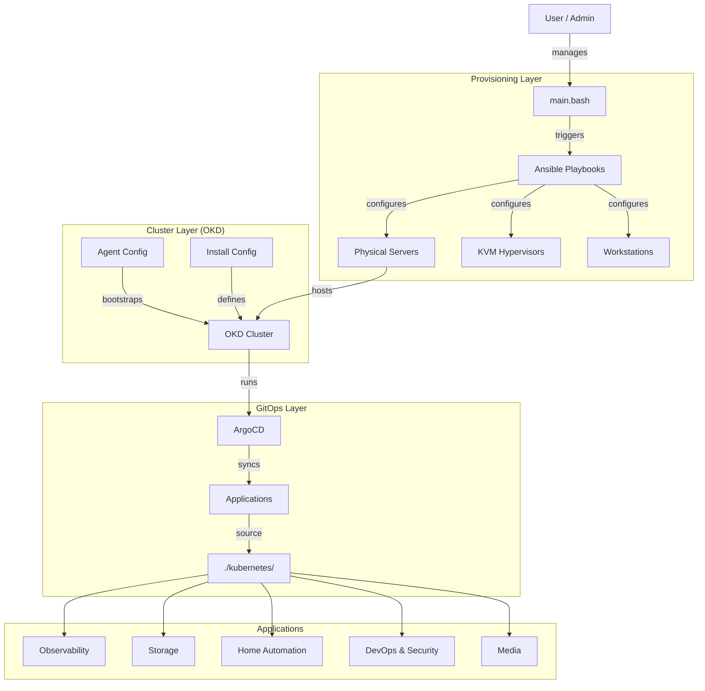
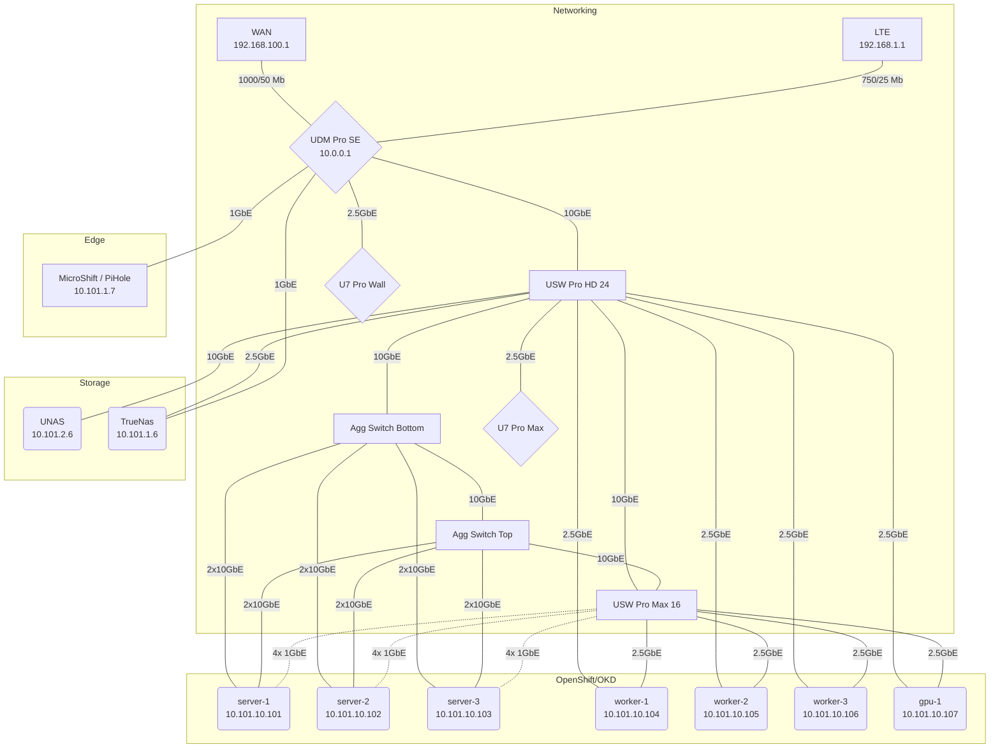

# HomeLab Infrastructure

For a detailed history of the project's evolution, see [CHANGELOG.md](CHANGELOG.md).

- [HomeLab Infrastructure](#homelab-infrastructure)
  - [Overview](#overview)
  - [🏗️ Architecture Overview](#️-architecture-overview)
  - [📂 Repository Structure](#-repository-structure)
  - [🚀 Components](#-components)
    - [1. Infrastructure \& Provisioning (`/ansible`, `/machineConfigs`)](#1-infrastructure--provisioning-ansible-machineconfigs)
  - [🖥️ Hardware Inventory](#️-hardware-inventory)
    - [Kubernetes](#kubernetes)
      - [Machines](#machines)
        - [Storage](#storage)
      - [Kubernetes Nodes](#kubernetes-nodes)
        - [Ceph Performance Tests](#ceph-performance-tests)
        - [GPU](#gpu)
  - [🌐 Network Architecture](#-network-architecture)
    - [Physical Topology](#physical-topology)
    - [Networking Machines](#networking-machines)
    - [VLAN Map](#vlan-map)
    - [2. Kubernetes Cluster (`/okd`)](#2-kubernetes-cluster-okd)
    - [3. GitOps \& Applications (`/kubernetes`)](#3-gitops--applications-kubernetes)
    - [4. Tooling (`/containers`, `main.bash`)](#4-tooling-containers-mainbash)
    - [5. Virtualization \& Cloud (`/vms`, `/terraform`)](#5-virtualization--cloud-vms-terraform)
  - [🛠️ Usage](#️-usage)
    - [Bootstrapping](#bootstrapping)
    - [Deploying a New App](#deploying-a-new-app)
      - [Kubernetes Commands](#kubernetes-commands)
        - [Delete Pod Using Graceful Termination Eviction Request](#delete-pod-using-graceful-termination-eviction-request)

## Overview

This repository contains the complete Infrastructure-as-Code (IaC) and GitOps configuration for my HomeLab. It manages everything from bare-metal server provisioning and virtualization to the Kubernetes (OKD) cluster and application deployment.

## 🏗️ Architecture Overview

The infrastructure is built in layers, starting from physical hardware management with Ansible, up to application deployment managed by ArgoCD.



## 📂 Repository Structure

```plaintext
├── ansible/            # Ansible playbooks for node configuration (KVM, Servers, Desktops)
│   ├── playbooks/      # Reusable Ansible playbooks
│   └── inventory       # Host inventory
├── containers/         # Custom container images (Toolbox, Utilities)
├── kubernetes/         # Kubernetes manifests for all applications (GitOps source)
│   ├── argocd/         # ArgoCD bootstrap configuration
│   ├── ceph/           # Rook-Ceph storage configuration
│   ├── ...             # Individual application folders (Traefik, Vault, etc.)
├── machineConfigs/     # Ignition/Preseed configs for machine provisioning
├── okd/                # OpenShift/OKD specific installation configs
│   ├── agent-config.yaml   # Node definitions for Agent Installer
│   └── install-config.yaml # Cluster configuration
├── tekton/             # Tekton Pipelines and Tasks
│   ├── base/           # Base Tekton configurations
│   ├── overlays/       # Environment-specific overlays
│   └── tasks/          # Reusable Tekton Tasks
├── terraform/          # Terraform configurations for infrastructure
│   ├── agent/          # Infrastructure for the Agent Based Terraform KVM
│   ├── homelab/        # Main HomeLab infrastructure
│   └── sandbox/        # Infrastructure for the UPI Based Terraform KVM
├── vms/                # Virtual Machine definitions (KubeVirt)
├── main.bash           # Central entrypoint script for management tasks
└── notes/              # Documentation, scratchpads, and manual scripts
```

## 🚀 Components

### 1. Infrastructure & Provisioning (`/ansible`, `/machineConfigs`)

- **Ansible**: Used to configure the base operating system (Fedora/CentOS Stream), set up KVM, and manage networking (NMState).
- **Networking**:
  - **Subnets**: Machine Network (`10.101.10.0/24`), Cluster Network (`10.101.32.0/19`).
  - **Bonding**: Nodes utilize bonded interfaces for redundancy and performance.
    - `active-backup`: Used for split-switch topologies or where LACP is unavailable.
    - `802.3ad` (LACP): Used for bandwidth aggregation on supported switches.
  - **MTU**: Jumbo frames (9000) are enabled for storage and cluster traffic.
- **Virtualization**: KVM is used to host virtualized control plane or worker nodes where applicable.

## 🖥️ Hardware Inventory

### Kubernetes

<https://www.okd.io/>

| Kubernetes Channel | OKD Version | OKD Channel   | OKD OS                    | Storage Layer |
| ------------------ | ----------- | ------------- | ------------------------- | ------------- |
| v1.34.\*           | 4.21-\*     | stable-scos-4 | CentOS Stream CoreOS 10.0 | CEPH          |

#### Machines

[CPU Benchmark](https://www.cpubenchmark.net/compare/Intel-i5-6600-vs-AMD-RX-427BB-vs-Intel-i3-2130-vs-AMD-GX-415GA-SOC-vs-AMD-Ryzen-7-5700G/2594vs2496vs755vs2081vs4323)

| Machine    | Model          | CPU        | CPU | Mem  | Storage                           | Networking              | ZFS Storage                       | Status         |
| ---------- | -------------- | ---------- | --- | ---- | --------------------------------- | ----------------------- | --------------------------------- | -------------- |
| MicroShift | Raspberry Pi 5 | BCM2712    | 4   | 8G   | 1TB NVME                          | 1x1GbE                  | N/A                               | MicroShift     |
| server-1   | N/A            | R7-5700G   | 16  | 128G | 2x4TB NVME, 2x1TB SSD, 2x.5TB SSD | 4x10Gbe (DAC) && 4x1GbE | N/A                               | OpenShift/OKD  |
| server-2   | N/A            | R7-5700G   | 16  | 128G | 2x4TB NVME, 2x1TB SSD,2x.5TB SSD  | 4x10Gbe (DAC) && 4x1GbE | N/A                               | OpenShift/OKD  |
| server-3   | N/A            | R7-5700G   | 16  | 128G | 2x4TB NVME, 2x1TB SSD,2x.5TB SSD  | 4x10Gbe (DAC) && 4x1GbE | N/A                               | OpenShift/OKD  |
| worker-1   | MS-A1-A5870    | R7-8700G   | 16  | 32G  | 1x1TB NVME                        | 2x2.5GbE                | N/A                               | OpenShift/OKD  |
| worker-2   | MS-A1-A5870    | R7-8700G   | 16  | 32G  | 1x1TB NVME                        | 2x2.5GbE                | N/A                               | OpenShift/OKD  |
| worker-3   | MS-A1-A5870    | R7-8700G   | 16  | 32G  | 1x1TB NVME                        | 2x2.5GbE                | N/A                               | OpenShift/OKD  |
| gpu-1      | N/A            | R5-3600    | 12  | 16G  | 2x1TB NVME                        | 1x2.5Gbe && 1x1GbE      | N/A                               | OpenShift/OKD  |
| TrueNas    | unas-pro       | Arm Cortex | 4   | 8G   | N/A                               | 1x2.5Gbe && 1x1GbE      | 3x2TB RaidZ1 SSD                  | TrueNas        |
| UNAS       | Hp ProDesk     | i5-6600    | 4   | 32G  | 120G SSD Boot Mirror              | 1x1Gbe && 1x10GbE       | 4x4TB Raid6 HDD / 3x2TB Raid5 SSD | UNAS           |
| pfSense    | Hp t730        | RX-427BB   | 4   | 4G   | 16G SSD                           | 4x1GbE                  | N/A                               | Decommissioned |
| Bare Metal | Hp t620        | GX-415GA   | 4   | 6G   | 16G SSD & 16G USB                 | 1x1GbE                  | N/A                               | Decommissioned |
| Spare      | Hp p7-1226s    | i3-2130    | 4   | 8G   | 240G SSD                          |                         | N/A                               | Decommissioned |

| Machine  | PPT | CPU Curve | GFX Curve | CPU Frequency | vMem | Memory Freq | Boost    |
| -------- | --- | --------- | --------- | ------------- | ---- | ----------- | -------- |
| server-1 | 35W | -30       | -30       | -1000         | 1.30 | 3200        | Disabled |
| server-2 | 35W | -30       | -30       | -1000         | 1.30 | 3200        | Disabled |
| server-3 | 35W | -30       | -30       | -1000         | 1.30 | 3200        | Disabled |
| worker-1 | 35W |           |           |               |      | 3200        | Disabled |
| worker-2 | 35W |           |           |               |      | 5200        | Disabled |
| worker-3 | 35W |           |           |               |      | 5200        | Disabled |

##### Storage

| Machine | Use                                            | Disks (SSD)                       |
| ------- | ---------------------------------------------- | --------------------------------- |
| UNAS    | Backup Nextcloud / Ceph Backup / WindowsBackup | 4x4TB HDD Raid6 / 3x2TB SSD Raid5 |
| TrueNas | UNAS Backup                                    | 3x2TB SSD RaidZ1                  |

#### Kubernetes Nodes

| Attribute             | Value                 |
| --------------------- | --------------------- |
| **NAME**              | server-1/2/3          |
| **ROLES**             | control-plane, worker |
| **CPU**               | 16                    |
| **Mem**               | 128G                  |
| **OS Disk**           | mdadm 2x5TB SSD       |
| **Container Overlay** | mdadm 2x1TB SSD       |
| **Ceph Storage**      | 2x4TB CEPH NVME       |
| **Nic's**             | 4x10GbE/1GbE A/P      |
| **Bond 0:** v10       | Host/Pod/LoadBalancer |
| **Bond 2:** v12       | Ceph Private          |
| **Bond 3:** v13       | Ceph Public           |
| **Bond 4:** v14       | VM Live Migrate       |
| **Bond 4.3**          | IOT                   |
| **Bond 4.11**         | Virtual Machines      |
| **Bond 4.111**        | Infrastructure        |

##### Ceph Performance Tests

|  test   | class  | threads | bk-size | iops-min | iops-max | iops-avg |  MB/s   |
| :-----: | :----: | :-----: | :-----: | :------: | :------: | :------: | :-----: |
|  seq-r  | cephfs |    4    |  256k   |   3968   |   5120   |   4641   |  1216   |
|  seq-r  | block  |    4    |  256k   |   3958   |   5120   |   4584   |  1202   |
|  seq-w  | cephfs |    4    |  256k   |   1024   |   2048   |   1661   |   436   |
|  seq-w  | block  |    4    |  256k   |   1023   |   2048   |   1627   |   427   |
| rand-r  | cephfs |    4    |  256k   |   3972   |   4854   |   4441   |  1164   |
| rand-r  | block  |    4    |  256k   |   3596   |   4726   |   4385   |  1150   |
| rand-w  | cephfs |    4    |  256k   |   266    |   2048   |   1553   |   397   |
| rand-w  | block  |    4    |  256k   |   1402   |   2048   |   1617   |   423   |
| rand-rw | cephfs |    4    |  256k   |   952    |   1418   |   1202   | 313/316 |
| rand-rw | block  |    4    |  256k   |   876    |   1410   |   1190   | 310/312 |

##### GPU

```bash
+-----------------------------------------------------------------------------------------+
| NVIDIA-SMI 580.95.05              Driver Version: 580.95.05      CUDA Version: 13.0     |
+-----------------------------------------+------------------------+----------------------+
| GPU  Name                 Persistence-M | Bus-Id          Disp.A | Volatile Uncorr. ECC |
| Fan  Temp   Perf          Pwr:Usage/Cap |           Memory-Usage | GPU-Util  Compute M. |
|                                         |                        |               MIG M. |
|=========================================+========================+======================|
|   0  NVIDIA GeForce GTX 1080        Off |   00000000:2B:00.0 Off |                  N/A |
| 27%   32C    P8             13W /  180W |       0MiB /   8192MiB |      0%      Default |
|                                         |                        |                  N/A |
+-----------------------------------------+------------------------+----------------------+

+-----------------------------------------------------------------------------------------+
| Processes:                                                                              |
|  GPU   GI   CI              PID   Type   Process name                        GPU Memory |
|        ID   ID                                                               Usage      |
|=========================================================================================|
|  No running processes found                                                             |
+-----------------------------------------------------------------------------------------+
```

- **Node**: `gpu-1`
- **Card**: NVIDIA GeForce GTX 1080 (8GB)
- **Driver**: 580.95.05 (CUDA 13.0)
- **Workload**: Transcoding (Plex/Immich), AI/ML experiments.

## 🌐 Network Architecture

The network is designed for high throughput (10GbE core) and segmentation via VLANs.

- **Router**: Ubiquiti UDM-SE (Gateway `10.0.0.1`)
  - WAN 1: 1Gbps Fiber
  - WAN 2: LTE Backup
- **Core Switching**:
  - **USW-Pro-HD-24**: 10GbE/2.5GbE Core Switch.
  - **USW-Aggregation** (x2): 10GbE Fiber/DAC aggregation layer.
  - **USW-Pro-Max-16**: 2.5GbE/1GbE distribution layer.
- **Wireless**: U7 Pro Max & U7 Pro Wall (WiFi 7).

### Physical Topology



### Networking Machines

| NAME             | Type   | Status |
| ---------------- | ------ | ------ |
| SB6183           | Modem  |        |
| UDM SE           | Router |        |
| USW Pro Max 16   | Switch |        |
| USW Aggregation  | Switch |        |
| USW Aggregation  | Switch |        |
| USWFlex XG 10GbE | Switch | Died   |
| U7 Pro Max       | AP     |        |
| U7 Pro Wall      | AP     |        |

### VLAN Map

| Site    | Range      |
| ------- | ---------- |
| 1       | 10.101.X.X |
| 2       | 10.102.X.X |
| Sandbox | 10.103.X.X |

| Name    | VLAN ID | Subnet        | Info                   |
| ------- | ------- | ------------- | ---------------------- |
| infra   | 1       | 10.102.1.0/24 |                        |
| clients | 2       | 10.102.2.0/24 |                        |
| iot     | 3       | 10.102.3.0/24 | TODO: Enable Isolation |

| Name                      | VLAN ID | Subnet         | Info                    |
| ------------------------- | ------- | -------------- | ----------------------- |
| infrastructure            | 111     | 10.101.1.0/24  |                         |
| clients                   | X       | 10.101.2.0/24  | TODO: Create            |
| iot                       | X       | 10.101.3.0/24  | TODO: Create            |
| openshift-machine-network | 10      | 10.101.10.0/24 | Host/Pod/Load Balancers |
| openshift-nad             | 11      | 10.101.11.0/24 | Virtual Machines        |
| openshift-ceph-private    | 12      | 10.101.12.0/24 | Isolated                |
| openshift-ceph-public     | 13      | 10.101.13.0/24 | Isolated                |
| openshift-lm              | 14      | 10.101.14.0/24 | Isolated                |
| openshift-ovn-network     | 15      | 10.101.15.0/24 | Isolated                |
| openshift-service-network | 16      | 10.101.16.0/22 | Isolated                |
| openshift-pod-network     | 32      | 10.101.32.0/19 | Isolated                |

| Name                           | VLAN ID | Subnet         | Info                    |
| ------------------------------ | ------- | -------------- | ----------------------- |
| virt-openshift-machine-network | 310     | 10.103.10.0/24 | Host/Pod/Load Balancers |
| virt-openshift-nad             | 311     | 10.103.11.0/24 | Virtual Machines        |
| virt-openshift-ceph-private    | 312     | 10.103.12.0/24 | Isolated                |
| virt-openshift-ceph-public     | 313     | 10.103.13.0/24 | Isolated                |
| virt-openshift-lm              | 314     | 10.103.14.0/24 | Isolated                |
| virt-openshift-ovn-network     | 315     | 10.103.15.0/24 | Isolated                |
| virt-openshift-service-network | 316     | 10.103.16.0/22 | Isolated                |
| virt-openshift-pod-network     | 332     | 10.103.32.0/19 | Isolated                |

### 2. Kubernetes Cluster (`/okd`)

- **Distribution**: OKD (OpenShift Kubernetes Distribution).
- **Installation**: Uses the **Agent-based Installer** for bare-metal deployment.
- **Configuration**:
  - `agent-config.yaml`: Defines the physical hosts, network interfaces, and static IP assignments.
  - `install-config.yaml`: Defines the cluster name, base domain, and networking CIDRs.

### 3. GitOps & Applications (`/kubernetes`)

- **Controller**: **ArgoCD** watches this repository and syncs the state of the cluster.
- **Storage Strategy**:
  - **Rook-Ceph**: Block, Object, and File storage for the cluster.
  - **MinIO**: S3-compatible object storage for applications.
  - **Longhorn**: Distributed block storage (alternative/backup).
- **Observability Stack**:
  - **Prometheus & Grafana**: Metrics collection and visualization.
  - **Loki**: Log aggregation.
  - **StackRox (ACS)**: Kubernetes security and compliance.
  - **Network Observability**: Flow logs and traffic analysis.
- **Security**:
  - **Vault**: Secret management.
  - **Cert-Manager**: Automated certificate management.
  - **External Secrets**: Syncing secrets from external providers.
- **Home Automation**:
  - **Home Assistant**: Central automation hub.
  - **ESPHome**: Microcontroller management.
- **DevOps**:
  - **Gitea**: Self-hosted Git service.
  - **Tekton**: CI/CD pipelines.
  - **Woodpecker**: CI/CD automation.

### 4. Tooling (`/containers`, `main.bash`)

- **Toolbox**: A custom container image (`containers/toolbox`) pre-loaded with CLI tools (`oc`, `kubectl`, `ansible`, `tofu`) for managing the environment.
- **main.bash**: A wrapper script to execute common tasks like running Ansible playbooks, fixing Kustomize files, or managing VMs.
  - `ansible`: Runs the Ansible playbooks for server configuration.
  - `kustomize_fix`: Fixes Kustomize files by running `kustomize edit fix`.
  - `test_overlays`: Validates Kubernetes manifests using `kubeconform` and `argocd-vault-plugin`.
  - `stateful_workload_stop`: Suspends CronJobs and scales down monitoring/stateful workloads (useful for maintenance).

### 5. Virtualization & Cloud (`/vms`, `/terraform`)

- **KubeVirt (`/vms`)**: Defines Virtual Machines (e.g., Fedora) running on top of the OKD cluster, managed via GitOps.
- **Terraform (`/terraform`)**: Manages external cloud resources (GCP) and integrates with Vault for secret management.

## 🛠️ Usage

### Bootstrapping

The environment is typically bootstrapped using the `main.bash` script which orchestrates the Ansible runs and prepares the OKD installer.

```bash
./main.bash
```

### Deploying a New App

1. Create a new folder in `kubernetes/<app-name>`.
2. Add Kubernetes manifests or a Kustomization file.
3. Register the application in ArgoCD (usually via `kubernetes/argocd/applications`).
4. Commit and push. ArgoCD will sync the changes automatically.

#### Kubernetes Commands

```bash
# Watch ALl Pods
watch kubectl get pods -A -o wide --sort-by=.metadata.creationTimestamp
# Watch non Health Pods
watch -n10 $(echo "kubectl get pods  -A | grep -vE 'Running|Completed'")
# Delete Pods that Have a Restart
kubectl get pods -A | awk '$5>0' | awk '{print "kubectl delete pod -n " $1 " " $2}' | bash -
# Drain Node
 oc adm drain server-3 --delete-emptydir-data --ignore-daemonsets --force
# Nextcloud
kubectl exec -it nextcloud-0 -n nextcloud -- runuser -u www-data -- php -f /var/www/html/occ
```

##### Delete Pod Using Graceful Termination Eviction Request

```bash
NAMESPACE=homelab
POD=el-webhook-6b56cc5f84-clfc6

curl --header "Authorization: Bearer $(oc whoami -t)" -H 'Content-type: application/json' \
"$(oc whoami --show-server)/api/v1/namespaces/{$NAMESPACE}/pods/{$POD}/eviction" \
-d '{"apiVersion": "policy/v1","kind": "Eviction","metadata": {"name": "'"${POD}"'","namespace": "'"${NAMESPACE}"'"}}'
```

- <https://docs.okd.io/latest/rest_api/policy_apis/eviction-policy-v1.html#eviction-policy-v1>
- <https://unofficial-kubernetes.readthedocs.io/en/latest/tasks/configure-pod-container/configure-pod-disruption-budget/>
