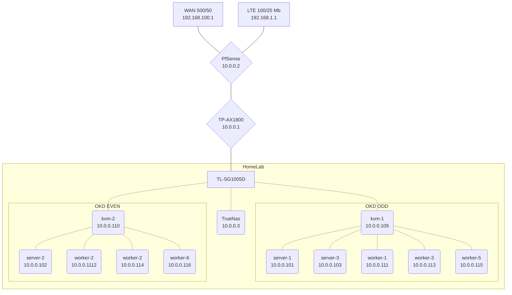

# HomeLab

HomeLab Server/Cluster, Virtual Sandbox Cluster, & Desktop Configuration

- Server: Debian Stable /w OKD & ZFS
- Desktop: Pop!\_OS Latest

  - Manual Patches Applied

    - <https://github.com/ArthurVardevanyan/pop-shell>
    - <https://github.com/ArthurVardevanyan/pop-cosmic>

## Desktop

```bash
ansible-playbook -i ansible/inventory --ask-become-pass ansible/desktop.yaml --ask-pass \
  -e 'ansible_python_interpreter=/usr/bin/python3'

git merge --no-ff
scp -r /mnt/storage/vm/*.img windowsBackup@10.0.0.4:/backup/WindowsBackup/vm
sudo sensors-detect
```

### Gnome

Manually Install Extensions from extensions.gnome.org

- gnome-shell-extension-netspeed
- gnome-shell-extension-places-menu
- gnome-shell-extension-transparentnotification

### Cura

Config files need to be applied manually.

```bash
machineConfigs/desktop/home/arthur/cura
```

## Virtual Sandbox

```bash
# Terminal 1
# Generate Preseed Config Password and Startup Temporary Web Server
bash kvm_k3s.bash preseed_server

# Terminal 2
# Enter Password Defined with Hash in Pre Seed Config
mkdir -p notes time bash kvm_k3s.bash install_cluster > notes/install.log

# KubeConfig
export KUBECONFIG=${HOME}/vm/sk3s/sk3s.yaml

# Dashboard Secret
bash main.bash get_dashboard_secret
```

## KVM Sandbox Terraform

TF Provider

- <https://github.com/dmacvicar/terraform-provider-libvirt>
- <https://registry.terraform.io/providers/dmacvicar/libvirt/latest/docs>

OpenShift Terraform Example

- <https://github.com/openshift/installer/blob/master/docs/dev/libvirt/README.md>
- <https://github.com/openshift/installer/tree/master/data/data/libvirt/bootstrap>

Permission Denied Issue

- <https://github.com/jedi4ever/veewee/issues/996#issuecomment-497976612>

## Server



### Kubernetes

<https://www.okd.io/>

| Kubernetes Channel | OKD Channel | OKD OS           | Host Operating System |
| ------------------ | ----------- | ---------------- | --------------------- |
| v1.24              | stable-4.11 | Fedora CoreOS 36 | Debian 11             |

**Machines:**

[CPU Benchmark](https://www.cpubenchmark.net/compare/Intel-i5-6600-vs-AMD-RX-427BB-vs-Intel-i3-2130-vs-AMD-GX-415GA-SOC-vs-AMD-Ryzen-7-5700G/2594vs2496vs755vs2081vs4323)

| Machine    | Model       | CPU      | CPU | Mem | Storage               | ZFS Storage    |
| ---------- | ----------- | -------- | --- | --- | --------------------- | -------------- |
| pfSense    | Hp t730     | RX-427BB | 4   | 4G  | 16G SSD               | N/A            |
| Bare Metal | Hp t620     | GX-415GA | 4   | 6G  | 16G SSD & 16G USB     | N/A            |
| kvm-1      | N/A         | R7-5700G | 16  | 96G | 1.5 TB NVME, .5TB SSD | N/A            |
| kvm-2      | N/A         | R7-5700G | 16  | 64G | 1.5 TB NVME, .5TB SSD | N/A            |
| TrueNas    | Hp ProDesk  | i5-6600  | 4   | 32G | 120G SSD Boot Mirror  | 2T HDD, 1T SSD |
| Spare      | Hp p7-1226s | i3-2130  | 4   | 8G  | 240G SSD              | N/A            |

| Machine | PPT | VOFFSET |
| ------- | --- | ------- |
| kvm-1   | 20W | -0.1625 |
| kvm-2   | 15W | -0.1625 |

**ZFS Storage:**

| Machine | Use     | Dataset   | Size  | Dataset         | Size  | Dataset       | Size  |
| ------- | ------- | --------- | ----- | --------------- | ----- | ------------- | ----- |
| TrueNas | Primary | Nextcloud | 750GB | Longhorn Backup | 175GB | N/A           | N/A   |
| TrueNas | Backup  | Nextcloud | 750GB | Longhorn Backup | 175GB | WindowsBackup | 750GB |

**Kubernetes Nodes:**

| NAME     | ROLES          | Machine | vCPU | Mem   | Storage |
| -------- | -------------- | ------- | ---- | ----- | ------- |
| server-1 | cp,etcd,master | kvm-1   | 4    | 15.5G | N/A     |
| server-2 | cp,etcd,master | kvm-2   | 4    | 13.5G | N/A     |
| server-3 | cp,etcd,master | kvm-1   | 4    | 15.5G | N/A     |
| worker-1 | worker         | kvm-1   | 4    | 20G   | LH NVME |
| worker-2 | worker         | kvm-2   | 4    | 15.5G | LH NVME |
| worker-3 | worker         | kvm-1   | 4    | 20G   | LH NVME |
| worker-4 | worker         | kvm-2   | 4    | 15.5G | LH NVME |
| worker-5 | worker         | kvm-1   | 4    | 20G   | LH NVME |
| worker-6 | worker         | kvm-2   | 4    | 15.5G | LH NVME |

#### OKD Longhorn Secondary Disk Setup

```bash
sudo fdisk /dev/vdb
sudo mkfs.ext4 -F /dev/vdb1
sudo su
echo "/dev/vdb1 /mnt/storage auto nofail" > /etc/fstab
```

#### OKD Upgrade

```bash
bash main.bash stateful_workload_stop
kubectl delete pdb -n longhorn-system --all
bash main.bash stateful_workload_start
```

#### OKD WIF

- <https://github.com/openshift/cloud-credential-operator/blob/master/docs/gcp_workload_identity.md>
- <https://github.com/openshift/cloud-credential-operator/blob/master/docs/ccoctl.md>

File Configuration Locations

```bash
ls ./terraform/gcp/HomeLab/homelab
ls ./terraform/gcp/HomeLab/homelab/wif
ls ./okd/okd-configuration/wif.yaml
```

CCOCTL Binary: <https://mirror.openshift.com/pub/openshift-v4/amd64/clients/ocp/stable/ccoctl-linux.tar.gz>

```bash
PROJECT_ID="$(vault kv get -field=project_id secret/gcp/org/av/projects)"

ccoctl gcp create-workload-identity-pool --name=okd-homelab-wif --project=homelab-${PROJECT_ID} --dry-run
ccoctl gcp create-workload-identity-provider --name=okd-homelab-wif --region=us --project=homelab-${PROJECT_ID} \
  --public-key-file=serviceaccount-signer.public --workload-identity-pool=okd-homelab-wif --dry-run
```

#### Kubernetes Commands

```bash
# Kubernetes Dashboard
# https://upcloud.com/community/tutorials/deploy-kubernetes-dashboard
kubectl get secret -n kubernetes-dashboard admin-user-token -o jsonpath="{.data.token}" | base64 --decode

# Watch ALl Pods
watch kubectl get pods -A -o wide --sort-by=.metadata.creationTimestamp
# Delete Pods that Have a Restart
kubectl get pods -A | awk '$5>0' | awk '{print "kubectl delete pod -n " $1 " " $2}' | bash -
# Drain Node
kubectl drain k3s-worker --ignore-daemonsets --delete-emptydir-data
# Vault
kubectl exec -it vault-0 -n vault -- vault operator unseal --tls-skip-verify
# Nextcloud
kubectl exec -it nextcloud-0 -n nextcloud -- runuser -u www-data -- php -f /var/www/html/occ

kubectl label node ${NODE} topology.kubernetes.io/zone=${ZONE} --overwrite
kubectl label node ${NODE} .okd.arthurvardevanyan.com node.longhorn.io/create-default-disk=true --overwrite
```

##### Delete Pod Using Graceful Termination Eviction Request

```bash
NAMESPACE=homelab
POD=el-webhook-6b56cc5f84-clfc6

curl --header "Authorization: Bearer $(oc whoami -t)" -H 'Content-type: application/json' \
"$(oc whoami --show-server)/api/v1/namespaces/{$NAMESPACE}/pods/{$POD}/eviction" \
-d '{"apiVersion": "policy/v1","kind": "Eviction","metadata": {"name": "'"${POD}"'","namespace": "'"${NAMESPACE}"'"}}'
```

- <https://docs.okd.io/latest/rest_api/policy_apis/eviction-policy-v1.html#eviction-policy-v1>
- <https://unofficial-kubernetes.readthedocs.io/en/latest/tasks/configure-pod-container/configure-pod-disruption-budget/>

#### SSH Keyscan

```bash
export IP_LIST="3 4 5 17 110 101 102 103 111 112 113 114"

rm -f /tmp/ssh_keyscan.txt
for IP in $( echo "$IP_LIST" ); do
ssh-keyscan 10.0.0."${IP}" >> /tmp/ssh_keyscan.txt

done

echo "\n\n\nSSH Keyscan\n\n"
cat /tmp/ssh_keyscan.txt
```

#### Vault Kubernetes Integration

```bash
# https://blog.ramon-gordillo.dev/2021/03/gitops-with-argocd-and-hashicorp-vault-on-kubernetes/
# https://cloud.redhat.com/blog/how-to-use-hashicorp-vault-and-argo-cd-for-gitops-on-openshift
# https://itnext.io/argocd-secret-management-with-argocd-vault-plugin-539f104aff05
vault auth enable kubernetes

token_reviewer_jwt=$(kubectl get secrets -n argocd -o jsonpath="{.items[?(@.metadata.annotations.kubernetes.io/service-account.name=='default')].data.token}" |base64 -d)

#kubernetes_host=$(oc whoami --show-server)
kubernetes_host="https://kubernetes.default.svc:443"

# Pod With Service Account Token Mounted
kubectl cp -n argocd toolbox-0:/var/run/secrets/kubernetes.io/serviceaccount/..data/ca.crt /tmp/ca.crt

vault write auth/kubernetes/config \
   token_reviewer_jwt="${token_reviewer_jwt}" \
   kubernetes_host=${kubernetes_host} \
   kubernetes_ca_cert=@/tmp/ca.crt \
   disable_local_ca_jwt=true

vault write auth/kubernetes/role/argocd \
    bound_service_account_names=default \
    bound_service_account_namespaces=argocd \
    policies=argocd \
    ttl=1h

vault policy write argocd - <<EOF
path "secret/*" {
    capabilities = ["create", "read", "update", "delete", "list"]
}
EOF

vault write auth/kubernetes/login role=argocd jwt=$(cat /var/run/secrets/kubernetes.io/serviceaccount/token)
```

## Database

### MariaDB

```sql
CREATE USER 'arthur'@'10.0.0.X' IDENTIFIED BY 'arthur';
GRANT ALL PRIVILEGES ON *.* TO `arthur`@`10.0.0.X`;

FLUSH PRIVILEGES;

# % for everything
CREATE USER 'spotifyTest'@'10.42.0.%' IDENTIFIED BY 'spotifyTest';
GRANT ALL PRIVILEGES ON spotifyTest.* TO `spotifyTest`@`10.42.0.%`;

# View Only Access
GRANT SELECT, LOCK TABLES, SHOW VIEW ON *.* TO 'backup'@'10.42.0.1' IDENTIFIED BY 'backup';
```

### Postgres

```psql
psql -h localhost -d quay -U quay
\c quay
CREATE EXTENSION pg_trgm;
```

## Quay

```bash
kubectl scale --replicas=0 deployment.apps/quay-operator-tng -n quay
kubectl scale --replicas=0 deployment.apps/quay-quay-config-editor -n quay
```

```yaml
# deployment/quay-quay-app
resources:
  limits:
    cpu: 1000m
    memory: 6Gi
  requests:
    cpu: 150m
    memory: 3Gi
# deployment/quay-clair-app
resources:
  limits:
    cpu: 500m
    memory: 2.5Gi
  requests:
    cpu: 150m
    memory: 750Mi
```

## Tekton

```bash
kubectl delete replicaSet -n openshift-pipelines --all

# Image Build
tkn -n homelab pipeline start image-build -s pipeline-sa \
  --param="git-url=https://git.arthurvardevanyan.com/ArthurVardevanyan/HomeLab" \
  --param="IMAGE=registry.arthurvardevanyan.com/homelab/toolbox:latest" \
  --param="git-commit=$(git log --format=oneline | cut -d ' ' -f 1 | head -n 1)" \
  --param="DOCKERFILE=./containerfile" \
  --workspace=name=data,volumeClaimTemplateFile=tekton/base/pvc.yaml \
  --showlog

tkn -n homelab pipeline start image-build -s pipeline-sa \
  --param="git-url=https://git.arthurvardevanyan.com/ArthurVardevanyan/HomeLab" \
  --param="IMAGE=registry.arthurvardevanyan.com/homelab/argocd:v2.4.17" \
  --param="git-commit=$(git log --format=oneline | cut -d ' ' -f 1 | head -n 1)" \
  --param="DOCKERFILE=./kubernetes/argocd/containerfile" \
  --workspace=name=data,volumeClaimTemplateFile=tekton/base/pvc.yaml \
  --showlog

# Ansible
tkn -n homelab pipeline start ansible -s pipeline-sa \
  --workspace=name=data,volumeClaimTemplateFile=tekton/base/pvc.yaml \
  --param="git-url=https://git.arthurvardevanyan.com/ArthurVardevanyan/HomeLab" \
  --param="playbooks=desktop" \
  --param="git-name=ArthurVardevanyan/HomeLab" \
  --param="git-commit=$(git log --format=oneline | cut -d ' ' -f 1 | head -n 1)" \
  --showlog
```
